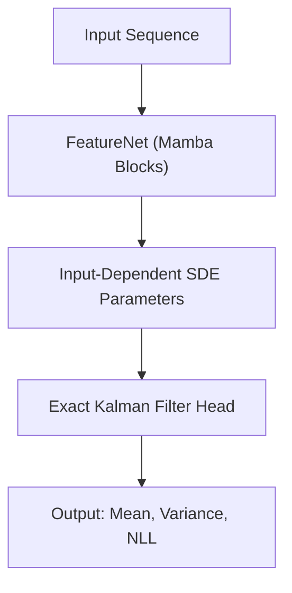

# Prob-Mamba: Probabilistic Time-Series Forecasting with State-Space Models


**Prob-Mamba** extends the Mamba selective state-space architecture with **stochastic dynamics** for uncertainty-aware time-series forecasting. By incorporating an **input-dependent stochastic differential equation (SDE)** and **zero-order hold (ZOH) discretization**, the model implements a **time-varying Linear Gaussian State-Space Model (LGSSM)** with **exact Kalman filtering** for principled probabilistic predictions.

> *This project was completed as part of an MSc Machine Learning dissertation at University College London (2024-2025).*

---

##  Overview

Traditional Mamba models excel at sequence modeling but provide only point predictions. **Prob-Mamba** addresses this limitation by introducing Gaussian diffusion into the state dynamics, enabling the model to capture and propagate uncertainty through time.

## Architecture

The model consists of:

- A **FeatureNet** built from Mamba blocks that projects inputs into a latent feature space.
- A **Probabilistic Head** that maps these features to time-varying LGSSM parameters and runs a Kalman filter.


---

## Mathematical Framework

### 1. Stochastic Selective Dynamics

The model extends Mamba's deterministic state equation with Gaussian diffusion:

$$
\text{d}h_t = \left(A h_t + B(x_t)x_t\right)\text{d}t + \Sigma(x_t)\,\text{d}W_t
$$

$$
y_t = C(x_t)h_t + \varepsilon_t, \quad \varepsilon_t \sim \mathcal{N}(0, R(x_t))
$$

**Key properties:**
- **Continuous-time drift**: $A = \mathrm{diag}(a_1, \ldots, a_n)$ with $a_i \leq 0$. 
- **Input-selective mappings**: $B(\cdot)$, $C(\cdot)$, $\Sigma(\cdot)$, $R(\cdot)$ learnt via neural networks
- **Well-posedness**: Global Lipschitz and linear growth conditions ensure unique strong solutions

### 2. Zero-Order Hold (ZOH) Discretization

The continuous SDE is discretised using ZOH, utilizing numerical stability helpers $\gamma(z) = \frac{e^z-1}{z}$ and $\rho(z) = \frac{e^{2z}-1}{2z}$:

$$
h_{k+1} = \bar{A}_k h_k + \bar{B}_k x_k + \eta_k, \quad \eta_k \sim \mathcal{N}(0, Q_k)
$$

where:
- $\bar{A}_k = \exp(\Delta_k A)$
- $\bar{B}_k = \mathrm{diag}(\gamma(\Delta_k A)\Delta_k) B(x_k)$
- $Q_k = \mathrm{diag}(\sigma_t^2 \rho(\Delta_k A) \Delta_k)$

The discretized system forms a **time-varying LGSSM**, enabling exact Bayesian inference.

### 3. Exact Kalman Filtering

The time-varying LGSSM admits closed-form inference via the Kalman filter:

**Prediction Step:**

$$
\begin{aligned}
\hat{h}_{k+1|k} &= \bar{A}k \hat{h}{k|k} + \bar{B}k x_k\\
P{k+1|k} &= \bar{A}k P{k|k} \bar{A}_k^\top + Q_k 
\end{aligned}
$$

**Update Step:**

$$
\begin{aligned}
e_{k+1} &= y_{k+1} - C_{k+1} \hat{h}_{k+1|k} \\
S_{k+1} &= C_{k+1} P_{k+1|k} C_{k+1}^\top + R_{k+1} \\
K_{k+1} &= P_{k+1|k} C_{k+1}^\top S_{k+1}^{-1} \\
\hat{h}_{k+1|k+1} &= \hat{h}_{k+1|k} + K_{k+1} e_{k+1} \\
P_{k+1|k+1} &= (I - K_{k+1}C_{k+1})P_{k+1|k}(I - K_{k+1}C_{k+1})^\top + K_{k+1}R_{k+1}K_{k+1}^\top
\end{aligned}
$$


**Training Objective**: Minimize negative log-likelihood (NLL):
$$
\mathcal{L} = -\sum_{k=1}^{T} \log p(y_k | x_{1:k}, y_{1:k-1})
$$

---

## Model Architecture

The Prob-Mamba architecture consists of three primary components designed to project inputs into a feature space and then apply probabilistic state-space modeling.


### 1. FeatureNet
Located in `src/prob_mamba/models.py`, this component handles the initial feature extraction using the official `mamba_ssm` backend:
* **Input Projection**: Linearly projects raw inputs to the feature dimension: $\mathbb{R}^{d_{\text{in}}} \to \mathbb{R}^{d_{\text{feat}}}$.
* **Residual Blocks**: Stacks `n_mamba_layers` Mamba blocks with residual connections (`z = z + blk(z)`) to capture long-range sequence dependencies [cite: 920-923].
* **Normalization**: Applies `LayerNorm` to the final features before passing them to the probabilistic head.

### 2. ProbMambaHead
Also in `src/prob_mamba/models.py`, this head implements the core probabilistic logic (Time-Varying LGSSM):
* **Learnable Parameters**:
    * **Static Dynamics**: The state transition matrix $A$ is modeled as a learnable, static diagonal parameter (`a_raw`), constrained to be negative via `-softplus`.
    * **Input-Dependent Maps**: Utilizes linear projections to map features $x_t$ to time-varying parameters $\Delta_t, B_t, C_t, \Sigma_t, R_t$ at every step [cite: 695-700].
* **Discretization**: Applies Zero-Order Hold (ZOH) using vectorized operations over the time dimension for efficiency.
* **Numerical Stability**:
    * **Positivity**: Enforces positivity on variances ($\Sigma, R$) and time-scales ($\Delta$) using `softplus` + $\epsilon$[cite: 705].
    * **Flooring & Clamping**: Implements specific floors (`sigma_floor=1e-3`, `R_floor=1e-4`) and range clamping (`delta_min=1e-3`, `z_clip=20.0`) to prevent numerical instability during Kalman updates.


### 3. Utility Functions
Located in `src/prob_mamba/utils.py`, these ensure numerical precision during the recurrence:
* **Discretization Helpers**: `gamma(z)` and `rho(z)` are implemented using `numpy.expm1` (or Torch equivalent) to maintain precision for small $\Delta$ values.
* **Robust Inversion**: `safe_cholesky` provides a robust decomposition for the innovation covariance $S_k$, using adaptive jitter (small amount of random noise) to handle near-singular matrices during training.

---

## 🧪 Experiments & Results

We evaluated Prob-Mamba against deterministic deep learning baselines (RNN, Vanilla Mamba) and classical econometric models (ARMA-GARCH) on three financial datasets: daly **NYSE Composite** and **NASDAQ Composite (IXIC)** data, and  **Bitcoin (BTC)** data at 5-minute intervals.

### Quantitative Performance

#### 1. NYSE Composite (Daily)
On the NYSE dataset, Prob-Mamba demonstrates superior volatility calibration compared to GARCH and improved point accuracy over Vanilla Mamba.

| Model | Params | Training Time (s) | Test RMSE | Test QLIKE |
| :--- | :--- | :--- | :--- | :--- |
| **RNN (Best Det.)** | 300k | 37.94 | **0.0020** | N/A |
| **Vanilla Mamba** | 300k | 32.11 | 0.0106 | N/A |
| **ARMA+GARCH** | N/A | N/A | 0.0106 | -8.11 |
| **Prob-Mamba** | ~100k | 5764.70 | **0.0074** | **-8.65** |


#### 2. NASDAQ Composite (IXIC) (Daily)
Similar to NYSE, Prob-Mamba outperforms the econometric baseline in both accuracy and uncertainty quantification.

| Model | Params | Training Time (s) | Test RMSE | Test QLIKE |
| :--- | :--- | :--- | :--- | :--- |
| **RNN (Best Det.)** | 100k | 13.66 | **0.0028** | N/A |
| **Vanilla Mamba** | 300k | 31.37 | 0.0195 | N/A |
| **ARMA+GARCH** | N/A | N/A | 0.0157 | -7.10 |
| **Prob-Mamba** | ~100k | 5766.52 | **0.0099** | **-8.24** |


#### 3. Bitcoin (5-minute)
On high-frequency data, the computational cost of the probabilistic head became a bottleneck. Prob-Mamba training was curtailed after 20 epochs due to excessive runtime.

| Model | Params | Training Time (s) | Test RMSE | Test QLIKE |
| :--- | :--- | :--- | :--- | :--- |
| **Vanilla Mamba** | 100k | 533.76 | **0.0022** | N/A |
| **ARMA+GARCH** | N/A | N/A | 0.0021 | **-10.97** |
| **Prob-Mamba*** | ~100k | 14,702.40 | 0.0040 | -9.04 |

*\*Note: Prob-Mamba results on BTC are from a partial run (20 epochs) due to compute constraints [cite: 1027-1028].*

---

### Analysis & Discussion


**1. Superior Uncertainty Calibration**
Prob-Mamba consistently achieved lower **QLIKE** scores compared to the econometric baseline GARCH(1,1) model. This indicates that the input-dependent diffusion term $\Sigma(x_t)$ is capacble of capturing the heteroskedastic nature of financial returns.

**2. Regularization via Stochasticity**
On equity datasets, Prob-Mamba outperformed Vanilla Mamba in point accuracy (RMSE). This suggests that the introduction of stochastic dynamics and exact inference acts as a form of regularization, preventing the overfitting observed in the deterministic Mamba models.

**3. The Computational Trade-off**
The primary limitation identified is computational cost. Prob-Mamba is approximately **two to three orders of magnitude slower** than deterministic baselines (e.g., ~5700s vs ~30s).
* **Reason**: The Kalman filter requires sequential matrix operations (inversion, multiplication) at every time step, preventing the use of Mamba's highly optimized parallel scan.
* **Impact**: This limits scalability to high-frequency data or very long sequences under standard training budgets.

---

## Installation

### Prerequisites
- Python 3.8+
- CUDA 11.8+ (for GPU support)
- PyTorch 2.1.0

### Setup

```bash
# Clone the repository
git clone https://github.com/micyiucm/Prob-Mamba.git
cd Prob-Mamba

# Create and activate virtual environment
python -m venv venv
source venv/bin/activate  # On Windows: venv\Scripts\activate

# Install dependencies
pip install -r requirements.txt

# Install mamba-ssm (GPU build)
pip install mamba-ssm causal-conv1d==1.5.2
```

> **Note**: The `mamba-ssm` package requires CUDA 11.8+.

---

## Usage

### Quick Start

```python
import torch
from prob_mamba.models import ProbabilisticMamba

# Initialize model
model = ProbabilisticMamba(
    d_in=50,           # Number of input features
    d_feat=128,        # Feature embedding dimension
    d_y=1,             # Output dimension (univariate forecasting)
    n_state=64,        # Hidden state dimension
    n_mamba_layers=2,  # Number of Mamba blocks
    mamba_cfg={"d_state": 64, "d_conv": 4, "expand": 2}
)

# Forward pass
x = torch.randn(32, 270, 50)  # (batch, sequence_length, features)
y = torch.randn(32, 270, 1)   # (batch, sequence_length, output_dim)

# Training mode (with targets)
outputs = model(x, y)
print(f"NLL: {outputs['nll']:.4f}")
print(f"Mean shape: {outputs['y_mean'].shape}")       # (32, 270, 1)
print(f"Variance shape: {outputs['y_var_diag'].shape}") # (32, 270, 1)

# Inference mode
with torch.no_grad():
    outputs = model(x, y)
    predictions = outputs['y_mean'][:, -1, :]  # Last-step predictions
    uncertainties = outputs['y_var_diag'][:, -1, :]
```

### Training Example

```python
import torch.optim as optim
from torch.utils.data import DataLoader, TensorDataset

# Prepare data loaders
train_loader = DataLoader(
    TensorDataset(X_train, y_train), 
    batch_size=64, 
    shuffle=True
)

# Initialize model and optimizer
model = ProbabilisticMamba(d_in=50, d_feat=128, d_y=1, n_state=64)
optimizer = optim.Adam(model.parameters(), lr=1e-3)
device = torch.device("cuda" if torch.cuda.is_available() else "cpu")
model.to(device)

# Training loop
model.train()
for epoch in range(100):
    epoch_loss = 0.0
    for x_batch, y_batch in train_loader:
        x_batch = x_batch.to(device)
        y_batch = y_batch.to(device)
        
        optimizer.zero_grad()
        outputs = model(x_batch, y_batch)
        loss = outputs['nll']
        loss.backward()
        torch.nn.utils.clip_grad_norm_(model.parameters(), 1.0)
        optimizer.step()
        
        epoch_loss += loss.item() * x_batch.size(0)
    
    avg_loss = epoch_loss / len(train_loader.dataset)
    if (epoch + 1) % 10 == 0:
        print(f"Epoch {epoch+1}: NLL = {avg_loss:.6f}")
```

### Evaluation

```python
from prob_mamba.eval import eval_prob_rmse_qlike_laststep

# Evaluate on test set
test_loader = DataLoader(
    TensorDataset(X_test, y_test),
    batch_size=64,
    shuffle=False
)

model.eval()
metrics = eval_prob_rmse_qlike_laststep(model, test_loader, device)

print(f"Test RMSE: {metrics['rmse']:.6f}")
print(f"Test QLIKE: {metrics['qlike']:.6f}")
print(f"Test NLL: {metrics['nll']:.6f}")
```

---


## License

This project is licensed under the MIT License.

